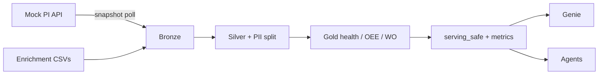

# PIAgents — PI Time Series → Databricks Lakehouse + Governance

Mock AVEVA PI–style continuous time series API, Databricks Unity Catalog medallion lakehouse, PII governance, metric views, Genie, and maintenance / RCA / shift agents.

> **Operations:** For line-by-line runbooks, diagrams, object catalogs, and on-call guides, start at **[docs/README.md](docs/README.md)** → **[Operations handbook](docs/operations/00_handbook.md)**.

---

## Documentation map

| Level | Document |
|---|---|
| High-level (this file) | Product summary, cost policy, quick start, layout |
| Ops index | [docs/README.md](docs/README.md) |
| Master ops handbook | [docs/operations/00_handbook.md](docs/operations/00_handbook.md) |
| End-to-end flow + diagrams | [docs/operations/01_end_to_end_flow.md](docs/operations/01_end_to_end_flow.md) |
| Mock PI API runbook | [docs/operations/02_mock_pi_api.md](docs/operations/02_mock_pi_api.md) |
| Databricks setup order | [docs/operations/03_databricks_runbook.md](docs/operations/03_databricks_runbook.md) |
| Every UC object explained | [docs/operations/04_medallion_catalog.md](docs/operations/04_medallion_catalog.md) |
| Jobs & compute / cost | [docs/operations/05_jobs_and_compute.md](docs/operations/05_jobs_and_compute.md) |
| Governance & PII | [docs/operations/06_governance_security.md](docs/operations/06_governance_security.md) |
| Genie & agents | [docs/operations/07_agents_and_genie.md](docs/operations/07_agents_and_genie.md) |
| Troubleshooting | [docs/operations/08_troubleshooting.md](docs/operations/08_troubleshooting.md) |
| Glossary | [docs/operations/09_glossary.md](docs/operations/09_glossary.md) |
| Architecture (concise) | [docs/architecture.md](docs/architecture.md) |
| Enrichment data dictionary | [docs/data_dictionary.md](docs/data_dictionary.md) |
| PII inventory / access / tags | [governance/](governance/) |
| Agent contracts & prompts | [agents/](agents/) |

---

## What it does



1. **Emit** continuous `TimeSeriesPoint` batches from a local FastAPI mock (3 assets × 7 tags).
2. **Land** points into `industrial_ops.bronze.pi_timeseries_raw` via Structured Streaming poll of `/snapshot/points`.
3. **Enrich** with CMMS / alarms / MES / shifts CSVs (some PII).
4. **Curate** silver ops tables; park identity fields in `ops_pii_restricted`.
5. **Serve** gold health scores, maintenance outcomes, OEE proxy, and metrics.
6. **Consume** only through `serving_safe` + `metrics` for Genie and agents.

**Primary use cases:** predictive maintenance, RCA narratives, shift briefings, OEE proxy analytics.

---

## Current status

| Area | State |
|---|---|
| Repo scaffolding (API, SQL, notebooks, governance, agent specs) | Complete |
| Local mock API | Runnable on port `8081` |
| Databricks UC / SQL / jobs from this repo | **Not executed by default** — code only |
| Genie / agents | Specs + contracts; configure after lakehouse is built |
| Working tree | Tracked on `main` → `origin/main` |

Details and ownership: [docs/operations/00_handbook.md](docs/operations/00_handbook.md).

---

## Compute / cost (read first)

- **Repo + local mock API alone incur $0 Databricks cost.**
- Do **not** deploy jobs or run SQL/notebooks until you intentionally attach the **existing small classic cluster**.
- **Serverless is forbidden.** Jobs pin classic cluster `0811-112417-qhhyebl0` via [`databricks/jobs/databricks.yml`](databricks/jobs/databricks.yml).
- Workspace host: `https://adb-7405605697371162.2.azuredatabricks.net` (Azure RG `databricks-rg-vamshi-dev-npujx7didcsju`).
- Creating UC objects or running notebooks uses that classic cluster while awake — only when an owner asks.

Full policy: [docs/operations/05_jobs_and_compute.md](docs/operations/05_jobs_and_compute.md).

---

## Quick start (mock API)

```bash
cd api
python3 -m venv .venv && source .venv/bin/activate
pip install -r requirements.txt
uvicorn app.main:app --host 127.0.0.1 --port 8081
```

Or: `./scripts/run_api.sh`

| Check | URL |
|---|---|
| Health | `GET http://localhost:8081/health` |
| Tags | `GET http://localhost:8081/tags` |
| SSE stream | `GET http://localhost:8081/stream/points` |
| Snapshot (Databricks poll) | `GET http://localhost:8081/snapshot/points` |

For Azure Databricks to reach this Mac, keep a tunnel up (e.g. `ngrok http 127.0.0.1:8081`) and set `PI_API_BASE` to the HTTPS URL. The bronze notebook sends `ngrok-skip-browser-warning` for free-tier tunnels.

Deep dive: [docs/operations/02_mock_pi_api.md](docs/operations/02_mock_pi_api.md).

---

## Databricks setup order (summary)

1. `databricks/sql/01_uc_foundation.sql` (catalog may need `storage_root` via API — metastore has no default)
2. `databricks/sql/02_bronze_tables.sql`
3. Upload `data/enrichment/*.csv` → `/Volumes/industrial_ops/bronze/landing`
4. Notebooks `01_bronze_pi_stream` (API up) and `02_bronze_enrichment_batch`
5. SQL `03_silver_tables.sql` → `05_gold_and_metrics.sql` → `04_serving_safe_views.sql` → `06_pii_masks_and_filters.sql`
6. Configure Genie/agents per [`agents/`](agents/) and [ops guide](docs/operations/07_agents_and_genie.md)

Step-by-step with verification SQL: [docs/operations/03_databricks_runbook.md](docs/operations/03_databricks_runbook.md).

---

## Layout

```
api/                  FastAPI mock PI emitter + PI adapter stub
data/enrichment/      MVP CSVs (assets, WOs, alarms, production, shifts)
databricks/notebooks/ Bronze stream + enrichment + curate stubs
databricks/sql/       UC, bronze/silver/gold, serving_safe, PII masks
databricks/jobs/      Databricks Asset Bundle (classic cluster pinned)
governance/           PII inventory, tags, access matrix
agents/               Genie space + agent tool contracts + prompts
docs/                 Architecture, data dictionary, **operations handbook**
scripts/              API launcher
tests/                Local smoke tests
```

---

## Governance highlights

- PII lives in `industrial_ops.ops_pii_restricted`.
- Genie/agents bind only to `serving_safe` + `metrics`.
- Column masks + plant row filters live in SQL and [`governance/`](governance/).
- Ops security runbook: [docs/operations/06_governance_security.md](docs/operations/06_governance_security.md).

---

## Key identities & endpoints

| Item | Value |
|---|---|
| UC catalog | `industrial_ops` |
| Classic cluster id | `0811-112417-qhhyebl0` |
| Workspace | `https://adb-7405605697371162.2.azuredatabricks.net` |
| Local API | `http://127.0.0.1:8081` |
| Landing volume | `/Volumes/industrial_ops/bronze/landing` |

---

## Contributing / changing the system

1. Prefer updating SQL sources of truth under `databricks/sql/` before notebook stubs.
2. Any new people-linked field → update [`governance/pii_inventory.md`](governance/pii_inventory.md) and serving-safe projections **before** Genie bind.
3. Keep adapter consumers on `TimeSeriesPoint` / HTTP contract only.
4. Do not enable serverless or unpinned job clusters without explicit approval.
