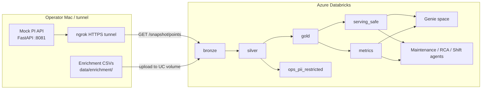

# Operations handbook — PIAgents

**Product name:** PI Time Series → Databricks Lakehouse + Governance  
**Repo:** https://github.com/vamshi455/PIAgents  
**Catalog:** `industrial_ops`  
**Workspace (configured, not yet deployed from this repo):** `https://adb-7405605697371162.2.azuredatabricks.net`  
**Resource group:** `databricks-rg-vamshi-dev-npujx7didcsju`

This handbook is the **master operations entry point**. Deeper topics link out to sibling docs.

---

## 1. What this project is

PIAgents is an MVP that:

1. **Emulates** an AVEVA PI–style continuous time-series feed (local FastAPI mock).
2. **Ingests** those points into a Databricks Unity Catalog medallion lakehouse (bronze → silver → gold).
3. **Enriches** with CMMS / alarms / MES / shift CSVs (including PII).
4. **Governs** identity data into `ops_pii_restricted` and exposes only de-identified surfaces to Genie and agents.
5. **Powers** four operational use cases: predictive maintenance, RCA, shift briefing, and OEE proxy analytics.

It is designed so the lakehouse never depends on mock internals — only on the canonical `TimeSeriesPoint` contract. A real PI Web API adapter is stubbed (`AvevaPIWebAPISource`).

---

## 2. Current operational status (as of docs write-up)

| Area | Status | Notes |
|---|---|---|
| Repo scaffolding | **Done** | API, SQL, notebooks, governance, agent specs |
| Local mock API | **Runnable** | Port `8081`; see [02_mock_pi_api.md](02_mock_pi_api.md) |
| Databricks UC / SQL / jobs | **Not executed from this repo** | Objects exist as code only |
| Genie space | **Spec only** | [../agents/genie_space.md](../agents/genie_space.md) |
| Agents | **Contracts + prompts only** | No runtime agent host in MVP |
| Serverless compute | **Forbidden** | Classic cluster only |

**Implication for ops:** Running SQL or notebooks will start the pinned classic cluster and incur cost. Do not deploy until intentional.

---

## 3. System context (high level)



---

## 4. Repository map (what each folder is for)

```
PIAgents/
├── README.md                 # High-level + links here
├── api/                      # FastAPI mock PI emitter
│   ├── app/main.py           # HTTP routes
│   ├── app/models.py         # TimeSeriesPoint contract
│   ├── app/simulator.py      # Asset/tag value generator
│   └── app/adapters.py       # MockPISource + Aveva stub
├── data/enrichment/          # MVP CSVs (assets, WOs, alarms, production, shifts)
├── databricks/
│   ├── sql/                  # UC + medallion DDL (run in order)
│   ├── notebooks/            # Bronze stream/batch + stubs
│   └── jobs/databricks.yml   # Asset Bundle — classic cluster pinned
├── governance/               # PII, tags, access matrix
├── agents/                   # Genie + agent contracts/prompts
├── docs/                     # This documentation tree
├── scripts/run_api.sh        # Convenience API launcher
└── tests/test_smoke.py       # Local CSV + simulator smoke tests
```

---

## 5. Roles & ownership

| Role | Owns | Primary docs |
|---|---|---|
| Platform / Databricks admin | UC catalog, cluster, DAB deploy, grants | [03](03_databricks_runbook.md), [05](05_jobs_and_compute.md), [06](06_governance_security.md) |
| Data engineer | Bronze stream, enrichment, silver/gold SQL | [01](01_end_to_end_flow.md), [04](04_medallion_catalog.md) |
| App operator | Mock API uptime + ngrok URL | [02](02_mock_pi_api.md) |
| Security / compliance | PII inventory, masks, audits | [06](06_governance_security.md), [../governance/](../../governance/) |
| Analytics / AI ops | Genie space + agents | [07](07_agents_and_genie.md) |
| On-call | Failures, cost spikes | [08](08_troubleshooting.md) |

---

## 6. Hard operational policies

1. **No serverless** — jobs and interactive work use classic cluster `0811-112417-qhhyebl0` only.
2. **No silent deploy** — do not `databricks bundle deploy` or run SQL until an owner asks.
3. **Agents/Genie never see PII schemas** — only `serving_safe` + `metrics`.
4. **Plant tenancy** — row filters by `plant_id` before multi-site production.
5. **Log identifiers only** — `asset_id`, `work_order_id`, `alarm_id`, `crew_id`; never email/phone/name in agent logs.

---

## 7. Primary use cases (business outcomes)

| Use case | Inputs | Outputs | Consumer |
|---|---|---|---|
| Predictive maintenance | Health score, anomaly flag, open WOs | Prioritized assets + recommendations | Maintenance advisor agent |
| RCA / incident | Tags, alarms, downtime window, failure history | Evidence-backed narrative + likely failure_code | RCA agent |
| Shift briefing | Overnight anomalies, active alarms, open priority WOs, redacted handoff | Crew briefing for `crew_id` | Shift briefing agent |
| OEE proxy | Production run/downtime + counts | Availability / quality / OEE proxy by line | Genie |

---

## 8. Environments & endpoints

| Item | Value |
|---|---|
| Local API | `http://127.0.0.1:8081` |
| Bundle `pi_api_base` default | `https://negligent-subsiding-habitat.ngrok-free.dev` (replace when tunnel changes) |
| Azure workspace host | `https://adb-7405605697371162.2.azuredatabricks.net` |
| Classic cluster id | `0811-112417-qhhyebl0` |
| UC catalog | `industrial_ops` |
| Landing volume | `/Volumes/industrial_ops/bronze/landing` |
| Stream checkpoint | `/Volumes/industrial_ops/bronze/landing/checkpoints/pi_timeseries` |

---

## 9. Documentation map

- [01 — End-to-end data flow](01_end_to_end_flow.md)
- [02 — Mock PI API](02_mock_pi_api.md)
- [03 — Databricks runbook](03_databricks_runbook.md)
- [04 — Medallion catalog](04_medallion_catalog.md)
- [05 — Jobs & compute](05_jobs_and_compute.md)
- [06 — Governance & security](06_governance_security.md)
- [07 — Agents & Genie](07_agents_and_genie.md)
- [08 — Troubleshooting](08_troubleshooting.md)
- [09 — Glossary](09_glossary.md)
- [Docs index](../README.md)
