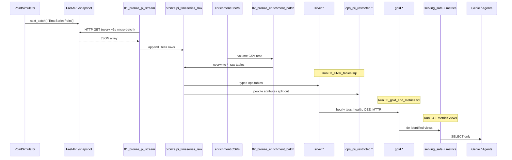
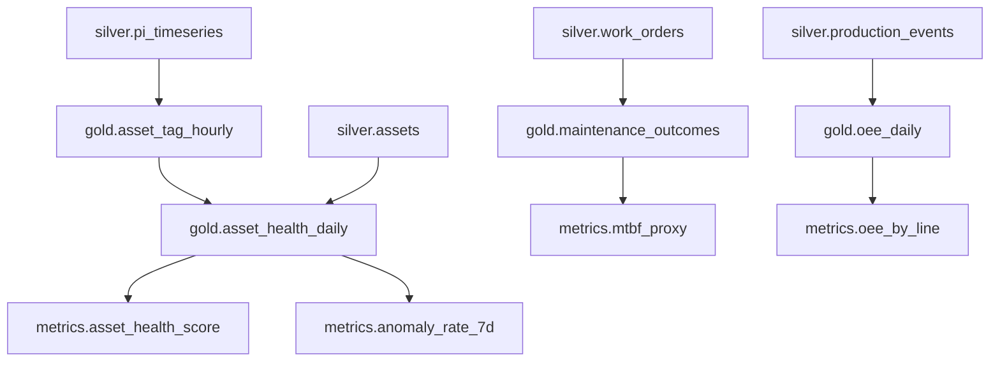

# End-to-end data flow (line by line)

This document walks the full path from simulated sensor values to Genie/agent answers. Read it left-to-right; each stage names the exact files and objects involved.

---

## 1. Big picture sequence

---

## 2. Stage A — Continuous time series generation

| Step | What happens | Code |
|---|---|---|
| A1 | Three assets defined: `PMP-12`, `PMP-14`, `CMP-03` at `PLANT-01` / `AREA-COMPRESS` | `api/app/simulator.py` → `ASSETS` |
| A2 | Seven tags per asset: Vibration, BearingTemp, SuctionPressure, DischargePressure, MotorAmps, RunStatus, RuntimeHours | `_TAG_SPECS` |
| A3 | Tag names look PI-like: `\\PLANT-01\PMP-12\|Vibration` | `build_tag_catalog()` |
| A4 | Each `next_batch()` emits **21 points** (3×7) with noise + slow degradation on critical tags | `PointSimulator.next_batch()` |
| A5 | Canonical model is `TimeSeriesPoint` (timestamp UTC, quality, uom, plant/area) | `api/app/models.py` |
| A6 | `MockPISource` wraps the simulator for HTTP | `api/app/adapters.py` |

**Ops note:** Degradation is intentional so health scores trend down for demos. Seed defaults to `42`.

---

## 3. Stage B — HTTP exposure (mock PI API)

| Endpoint | Purpose | Used by Databricks? |
|---|---|---|
| `GET /health` | Liveness | Manual / probes |
| `GET /tags` | Tag catalog | Manual / discovery |
| `GET /status` | Emit counters | Manual |
| `GET /stream/points` | SSE continuous batches | Optional (not used by bronze notebook) |
| `GET /snapshot/points` | One JSON batch | **Yes — bronze stream polls this** |

Default bind: host `127.0.0.1` or `0.0.0.0`, port **8081**.  
Interval: `PI_STREAM_INTERVAL_MS` (default `1000`) for SSE; snapshot always returns one fresh batch.

For Azure reachability, ops runs ngrok (or similar) and sets `PI_API_BASE` to the public HTTPS URL. Free ngrok requires header `ngrok-skip-browser-warning: true` (already in the bronze notebook).

Details: [02_mock_pi_api.md](02_mock_pi_api.md).

---

## 4. Stage C — Bronze PI streaming ingest

**Notebook:** `databricks/notebooks/01_bronze_pi_stream.py`  
**Target table:** `industrial_ops.bronze.pi_timeseries_raw`

| Step | Detail |
|---|---|
| C1 | Spark `rate` source at 1 row/sec drives micro-batches |
| C2 | Trigger: `processingTime = 5 seconds` |
| C3 | Each batch calls `fetch_snapshot(PI_API_BASE)` |
| C4 | JSON mapped to typed columns; `timestamp` → `event_ts`; adds `ingest_ts`, `raw_payload` |
| C5 | Append to Delta with CDF enabled (table DDL) |
| C6 | Checkpoint under UC volume path |

**Environment variables (cluster / job):**

| Var | Default | Meaning |
|---|---|---|
| `PI_API_BASE` | Bundle ngrok URL | API base reachable from cluster |
| `PI_BRONZE_CHECKPOINT` | `/Volumes/industrial_ops/bronze/landing/checkpoints/pi_timeseries` | Streaming checkpoint |

**Failure behavior:** fetch errors are printed and the batch is skipped (stream keeps running). Ops should watch driver logs for `fetch failed`.

---

## 5. Stage D — Enrichment batch (CMMS / MES / workforce)

**Files:** `data/enrichment/*.csv`  
**Notebook:** `databricks/notebooks/02_bronze_enrichment_batch.py`  
**Landing:** `/Volumes/industrial_ops/bronze/landing` (or `ENRICHMENT_LANDING`)

| CSV | Bronze table | Mode |
|---|---|---|
| `assets.csv` | `bronze.assets_raw` | overwrite |
| `work_orders.csv` | `bronze.work_orders_raw` | overwrite |
| `alarms.csv` | `bronze.alarms_raw` | overwrite |
| `production_events.csv` | `bronze.production_events_raw` | overwrite |
| `shifts.csv` | `bronze.shifts_raw` | overwrite |

Each load adds `ingest_ts` and `source_file`.  
**PII warning:** work orders, alarms ack names, and shifts contain direct identifiers at this layer.

Column meanings: [../data_dictionary.md](../data_dictionary.md).

---

## 6. Stage E — Silver curation + PII split

**SQL:** `databricks/sql/03_silver_tables.sql`

| Silver table | Source | Transformation summary |
|---|---|---|
| `silver.assets` | assets_raw | Cast install_date; null empty parent |
| `silver.pi_timeseries` | pi_timeseries_raw | Filter quality Good/Uncertain; extract `tag_suffix` |
| `silver.work_orders` | work_orders_raw | Typed timestamps/priority; **drops name/email/badge** (kept as employee_id + notes) |
| `silver.alarms` | alarms_raw | Typed times; keeps `acked_by_employee_id` only |
| `silver.production_events` | production_events_raw | Typed counts/times |
| `silver.shifts` | shifts_raw | Keeps `crew_id` + redacted-capable handoff notes; no emails/phones in ops table |

PII tables in `ops_pii_restricted` (same SQL file) hold technician/supervisor/operator identity columns for privileged readers only.

---

## 7. Stage F — Gold facts and health scoring

**SQL:** `databricks/sql/05_gold_and_metrics.sql`

### Health score formula (rule-based MVP)

Starting at `100`, subtract:

- `(vib - 2.5) * 15` when vibration above 2.5 mm/s
- `(bearing_temp - 70) * 2` when bearing temp above 70 °C
- `(motor_amps - 48) * 1.5` when amps above 48 A

Clamp to `[0, 100]`.

**Anomaly flag:** `TRUE` if `vib > 4.0` OR `bearing_temp > 85`.

### Other gold objects

- `maintenance_outcomes` — WO facts + `mttr_hours`
- `oee_daily` — run/down hours, quality_ratio, availability_ratio
- Metric views — KPI-shaped SELECT wrappers for Genie/agents

---

## 8. Stage G — Serving-safe surface

**SQL:** `databricks/sql/04_serving_safe_views.sql`

| View | Purpose |
|---|---|
| `serving_safe.work_orders` | Role proxy instead of person; no email/badge |
| `serving_safe.alarms` | `was_acked` boolean instead of person name |
| `serving_safe.shifts` | `handoff_notes_redacted` (demo name scrub) |
| `serving_safe.assets` | Pass-through from silver |
| `serving_safe.asset_health_daily` | Pass-through from gold |
| `serving_safe.oee_daily` | Pass-through from gold |
| `serving_safe.maintenance_outcomes` | No people columns |
| `serving_safe.pi_timeseries_recent` | Last 7 days of typed PI points |

**Hard rule:** Genie and agent service principals SELECT **only** here + `metrics`.

---

## 9. Stage H — Governance apply

**SQL:** `databricks/sql/06_pii_masks_and_filters.sql`  
**Notebook stub:** `databricks/notebooks/04_governance_apply.py`

Applies UC tags, column masks (`mask_email`, `mask_phone`, `mask_name`), plant row filters, and grants per [06_governance_security.md](06_governance_security.md).

---

## 10. Stage I — Consumption

| Consumer | Binding | Docs |
|---|---|---|
| Genie space `industrial-ops-pm` | serving_safe + metrics | [07_agents_and_genie.md](07_agents_and_genie.md) |
| Maintenance advisor | Tools over health + open WOs | [../../agents/tool_contracts.md](../../agents/tool_contracts.md) |
| RCA agent | Alarms + tags + downtime + failures | same |
| Shift briefing | Crew context + overnight anomalies | same |

---

## 11. Job orchestration (when deployed)

From `databricks/jobs/databricks.yml`:

1. Job `pi-bronze-timeseries-stream` → notebook `01_bronze_pi_stream` (long-running).
2. Job `pi-enrichment-silver-gold` → `02_bronze_enrichment_batch` then stub `03_silver_gold_transforms` (SQL scripts are the real silver/gold source of truth until the stub is implemented).

See [05_jobs_and_compute.md](05_jobs_and_compute.md).

---

## 12. Operator checklist (happy path)

1. Start mock API on 8081; verify `/health` and `/snapshot/points`.
2. Expose via tunnel; update `PI_API_BASE` / bundle variable.
3. Create catalog/schemas/volume (`01_uc_foundation.sql` + API storage root as needed).
4. Create bronze tables (`02_bronze_tables.sql`).
5. Upload CSVs to landing volume.
6. Start bronze stream notebook/job; confirm appends to `pi_timeseries_raw`.
7. Run enrichment notebook; confirm `*_raw` row counts.
8. Run silver → gold → serving_safe → PII SQL in order.
9. Apply governance SQL; verify Genie SP cannot see PII.
10. Configure Genie/agents; smoke-test sample questions.
