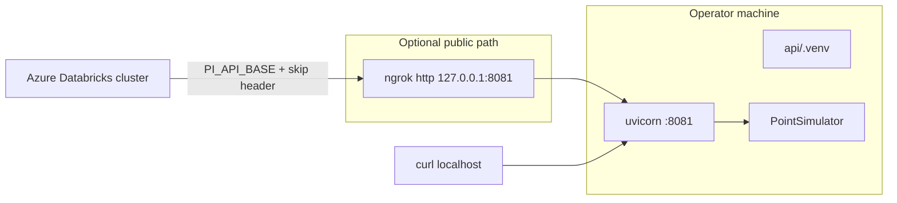

# Mock PI API — operations runbook

Local FastAPI service that continuously generates PI-like time series for Databricks ingest.

---

## 1. Purpose

- Provide a **reachable, continuous** source of `TimeSeriesPoint` events without a real AVEVA PI System.
- Keep the **adapter boundary** clean so production can later swap `MockPISource` → `AvevaPIWebAPISource`.

---

## 2. Runtime topology



---

## 3. Install & start

```bash
cd api
python3 -m venv .venv
source .venv/bin/activate
pip install -r requirements.txt
uvicorn app.main:app --host 127.0.0.1 --port 8081
```

Convenience script (binds `0.0.0.0`, port from `PORT` or `8081`):

```bash
./scripts/run_api.sh
```

### Dependencies

| Package | Role |
|---|---|
| `fastapi` | HTTP API |
| `uvicorn[standard]` | ASGI server |
| `pydantic` | Models / validation |
| `sse-starlette` | SSE stream |
| `httpx` | Client utility (tests/adapters) |

---

## 4. Environment variables

| Variable | Default | Effect |
|---|---|---|
| `PI_STREAM_INTERVAL_MS` | `1000` | SSE emit interval (ms); clamped 100–60000 via query override |
| `PORT` | `8081` | Used by `scripts/run_api.sh` only |

---

## 5. Endpoints (ops reference)

### `GET /health`

```json
{"status":"ok","service":"pi-mock-streamer","version":"0.1.0"}
```

Use for process supervision and tunnel smoke tests.

### `GET /tags`

Returns the full tag catalog (3 assets × 7 tags). Each item includes `tag_name`, `asset_id`, `uom`, `description`, `nominal`, noise/drift metadata.

### `GET /status`

```json
{
  "streaming": true,
  "interval_ms": 1000,
  "assets": 3,
  "tags_per_asset": 7,
  "points_emitted": 1234
}
```

### `GET /stream/points?interval_ms=1000`

Server-Sent Events. Event name: `points`. Data: JSON array of `TimeSeriesPoint`.  
Useful for demos/clients; **bronze notebook does not use SSE**.

### `GET /snapshot/points`

One-shot JSON array of the next simulator batch (~21 points).  
**This is the Databricks ingest contract.**

Example point:

```json
{
  "tag_name": "\\\\PLANT-01\\PMP-12|Vibration",
  "asset_id": "PMP-12",
  "timestamp": "2026-08-13T10:00:00+00:00",
  "value": 2.61,
  "quality": "Good",
  "uom": "mm/s",
  "source_system": "mock_pi",
  "plant_id": "PLANT-01",
  "area_id": "AREA-COMPRESS"
}
```

---

## 6. Simulated plant model

| Asset | Criticality | Area |
|---|---|---|
| `PMP-12` Feed Pump 12 | A | `AREA-COMPRESS` |
| `PMP-14` Feed Pump 14 | B | `AREA-COMPRESS` |
| `CMP-03` Process Compressor 03 | A | `AREA-COMPRESS` |

| Tag suffix | UOM | Nominal | Notes |
|---|---|---|---|
| Vibration | mm/s | 2.5 | drifts up (health penalty) |
| BearingTemp | degC | 65 | drifts up |
| SuctionPressure | bar | 1.2 | noisy |
| DischargePressure | bar | 8.5 | noisy |
| MotorAmps | A | 42 | mild drift |
| RunStatus | bool | 1 | running |
| RuntimeHours | h | 12400 | increments with time |

Health scoring in gold uses Vibration / BearingTemp / MotorAmps / RunStatus — see [01_end_to_end_flow.md](01_end_to_end_flow.md).

---

## 7. Exposing the API to Azure Databricks

Clusters cannot reach `127.0.0.1` on your laptop. Ops must:

1. Keep the API running on 8081.
2. Start a tunnel, e.g. `ngrok http 127.0.0.1:8081`.
3. Copy the HTTPS URL into:
   - Cluster/job env `PI_API_BASE`
   - Bundle variable `pi_api_base` in `databricks/jobs/databricks.yml`
   - Optional local note file `.pi_api_public_url` (gitignored if you prefer; currently tracked in some clones — treat as ephemeral)
4. Confirm from a Databricks notebook:

```python
import urllib.request, json
url = "https://YOUR-SUBDOMAIN.ngrok-free.dev/snapshot/points"
req = urllib.request.Request(url, headers={"ngrok-skip-browser-warning": "true"})
print(json.loads(urllib.request.urlopen(req, timeout=30).read()))
```

**Free ngrok interstitial:** without the skip header, Databricks receives HTML and JSON parse fails.

---

## 8. Adapter swap (future production)

| Class | Role |
|---|---|
| `TimeSeriesPoint` | Stable contract |
| `MockPISource` | Demo generator (current) |
| `AvevaPIWebAPISource` | Stub for real PI Web API / channels |

Consumers (bronze notebook, jobs) must keep depending on HTTP contract + `TimeSeriesPoint` fields only.

---

## 9. Local verification

```bash
# from repo root with api venv active
curl -s http://127.0.0.1:8081/health
curl -s http://127.0.0.1:8081/snapshot/points | python3 -m json.tool | head
pytest tests/test_smoke.py
```

Smoke tests verify enrichment CSVs exist and a simulator batch has 21 points with `source_system=mock_pi`.

---

## 10. Ops responsibilities

| Task | Cadence |
|---|---|
| Keep API process up during stream demos | While bronze stream runs |
| Refresh ngrok URL when tunnel restarts | Each tunnel session |
| Update Databricks `PI_API_BASE` when URL changes | Same |
| Do not leave tunnel + stream running unattended overnight without cost ownership | Always |
