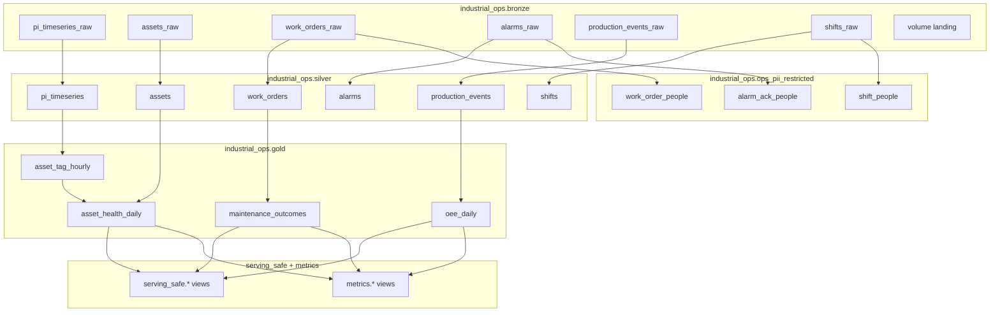

# Medallion objects catalog

Every Unity Catalog schema/object defined by this project, with purpose and lineage.

---

## Schema summary

| Schema | Mutability | PII | Who uses |
|---|---|---|---|
| `bronze` | Append / overwrite landings | May contain | Pipeline SPs, engineers |
| `silver` | Rebuilt from bronze | Employee ids / notes only | Engineers, some analysts |
| `gold` | Rebuilt from silver | None (by design) | Analysts, metrics |
| `ops_pii_restricted` | Built from bronze | **Yes** | `industrial_ops_pii_readers` only |
| `serving_safe` | Views | No direct PII | Genie, agents, readers |
| `metrics` | Views | No | Genie, agents, readers |

---

## Bronze

### `pi_timeseries_raw`

| Column | Type | Notes |
|---|---|---|
| tag_name | STRING | PI-style path |
| asset_id | STRING | Equipment id |
| event_ts | TIMESTAMP | Event time |
| value | DOUBLE | Measurement |
| quality | STRING | Good / Bad / Uncertain |
| uom | STRING | Unit |
| source_system | STRING | `mock_pi` or future `aveva_pi` |
| plant_id / area_id | STRING | Hierarchy |
| ingest_ts | TIMESTAMP | Landing time |
| raw_payload | STRING | JSON snapshot of source fields |

CDF enabled. Append-only from stream notebook.

### Enrichment `*_raw` tables

Mirror CSV headers plus `ingest_ts`, `source_file`. All columns STRING at landing for resilience. See [../data_dictionary.md](../data_dictionary.md) for business meanings.

---

## Silver

| Table | Key columns | Notes |
|---|---|---|
| `assets` | plant/area/unit/asset ids, criticality | Asset master |
| `pi_timeseries` | + `tag_suffix` | Quality filtered |
| `work_orders` | status, failure_code, technician_employee_id | No name/email/badge |
| `alarms` | severity, codes, acked_by_employee_id | No acked_by_name |
| `production_events` | event_type, counts | OEE inputs |
| `shifts` | crew_id, handoff_notes | People contact fields removed |

---

## PII restricted

Exact DDL is in `03_silver_tables.sql`. Conceptually:

| Table | Holds |
|---|---|
| `work_order_people` | technician name, email, badge ↔ work_order_id |
| `alarm_ack_people` | acked_by_name ↔ alarm_id |
| `shift_people` | supervisor/operator name, email, phone, employee_id ↔ shift_id |

Masks and plant filters: `06_pii_masks_and_filters.sql`.

---

## Gold

### `asset_tag_hourly`

Hourly avg/max/min/stddev/`sample_count` per `asset_id` + `tag_suffix`.

### `asset_health_daily`

Daily pivots of Vibration / BearingTemp / MotorAmps / RunStatus plus:

- `health_score` (0–100 rule-based)
- `anomaly_flag`
- joined `asset_name`, `criticality`

### `maintenance_outcomes`

Work order lifecycle + `mttr_hours`.

### `oee_daily`

Per plant/area/line/day:

- `run_hours`, `down_hours`
- `good_count`, `scrap_count`, `planned_count`
- `quality_ratio`, `availability_ratio`

---

## Metrics views

| View | Definition gist |
|---|---|
| `metrics.asset_health_score` | Latest-friendly projection of daily health |
| `metrics.anomaly_rate_7d` | anomaly days / days observed (7d) |
| `metrics.mtbf_proxy` | closed failure WO counts + avg MTTR |
| `metrics.oee_by_line` | `availability_ratio * quality_ratio` as `oee_proxy` |

---

## Serving-safe views

| View | Source | Redaction behavior |
|---|---|---|
| `work_orders` | silver.work_orders | `technician_role` from priority |
| `alarms` | silver.alarms | `was_acked` boolean |
| `shifts` | silver.shifts | regex redacts demo person names in notes |
| `assets` | silver.assets | passthrough |
| `asset_health_daily` | gold | passthrough |
| `oee_daily` | gold | passthrough |
| `maintenance_outcomes` | gold | selected non-PII columns |
| `pi_timeseries_recent` | silver.pi_timeseries | last 7 days only |

---

## Volume paths

| Path | Use |
|---|---|
| `/Volumes/industrial_ops/bronze/landing/` | CSV upload root |
| `/Volumes/industrial_ops/bronze/landing/checkpoints/pi_timeseries` | Structured Streaming checkpoint |

---

## Rebuild guidance

| Change | Rebuild |
|---|---|
| New PI points | Stream appends automatically |
| CSV content update | Re-run enrichment notebook (overwrite) then silver→gold→views |
| Health formula change | Edit `05_gold_and_metrics.sql`, re-run gold + dependent views |
| New PII field | Update inventory + silver split + masks **before** any Genie bind |
