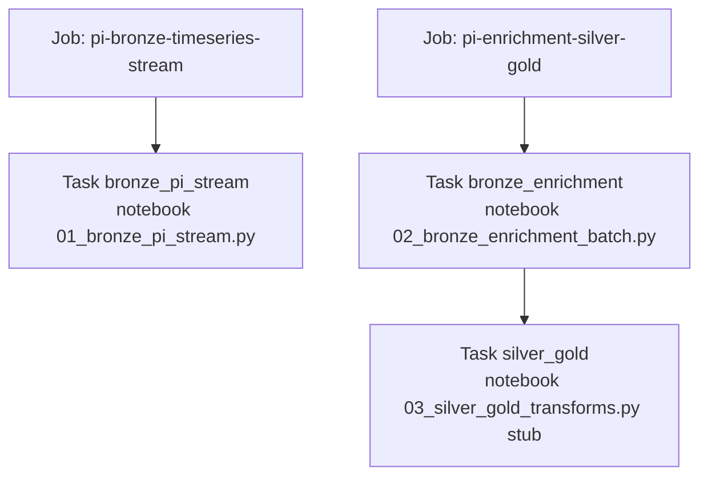

# Jobs & compute policy

This project is intentionally **cost-sensitive**. Platform and FinOps should treat every cluster wake as billable.

---

## 1. Non-negotiable compute rules

| Rule | Detail |
|---|---|
| Serverless | **Forbidden** for jobs, notebooks, warehouses used by this MVP unless explicitly re-approved later |
| Job clusters | Do not define new job clusters in the bundle |
| Existing classic only | Pin `existing_cluster_id: 0811-112417-qhhyebl0` |
| Cluster label | `vsingam@mhktechinc.com's Cluster 2026-08-11 06:19:00` |
| Repo-only work | Editing code / running local API = **$0 Databricks** |

Source of truth: `databricks/jobs/databricks.yml` + root README.

---

## 2. Workspace binding

| Setting | Value |
|---|---|
| Bundle name | `pi-databricks-lakehouse` |
| Target | `dev` (default, development mode) |
| Host | `https://adb-7405605697371162.2.azuredatabricks.net` |
| Managed RG | `databricks-rg-vamshi-dev-npujx7didcsju` |

---

## 3. Bundle variables

| Variable | Default | Purpose |
|---|---|---|
| `pi_api_base` | `https://negligent-subsiding-habitat.ngrok-free.dev` | Base URL for mock API from cluster |
| `existing_cluster_id` | `0811-112417-qhhyebl0` | Classic all-purpose cluster |

Update `pi_api_base` whenever the tunnel URL changes.

---

## 4. Defined jobs



### Job A — `pi_bronze_stream` / display name `pi-bronze-timeseries-stream`

| Field | Value |
|---|---|
| Task | `bronze_pi_stream` |
| Notebook | `../notebooks/01_bronze_pi_stream.py` |
| Cluster | `${var.existing_cluster_id}` |
| Nature | Long-running Structured Streaming |

**Ops:** Start only when API tunnel is healthy. Cancel when demo ends.

### Job B — `enrichment_and_curate` / display name `pi-enrichment-silver-gold`

| Task | Depends on | Notebook |
|---|---|---|
| `bronze_enrichment` | — | `02_bronze_enrichment_batch.py` |
| `silver_gold` | bronze_enrichment | `03_silver_gold_transforms.py` (**stub**) |

**Ops:** Until the silver/gold notebook is implemented, run SQL files `03` and `05` manually after enrichment (see [03_databricks_runbook.md](03_databricks_runbook.md)).

---

## 5. Deploy & run commands (approved only)

```bash
cd databricks/jobs
databricks bundle validate -t dev
databricks bundle deploy -t dev
databricks bundle run -t dev pi_bronze_stream
databricks bundle run -t dev enrichment_and_curate
```

Authentication must target the Azure workspace host above.

**Default posture:** files are committed; **deploy has not been done from the repo by policy**.

---

## 6. Cost control playbook

1. Prefer stopped classic cluster when idle.
2. Never leave bronze stream running overnight without an owner.
3. Prefer short interactive SQL sessions; stop warehouse/cluster after.
4. Local API + CSVs alone do not bill Databricks.
5. If cost spike appears, first check for orphaned streaming queries + awake classic cluster.

---

## 7. Service principals (planned)

| SP | Jobs / usage |
|---|---|
| `sp_pi_ingest` | Run bronze stream + enrichment (bronze/silver RW) |
| `sp_genie_industrial` | Genie queries only |
| `sp_agent_maintenance` | Agent tools only |

Do not grant ingest SP on Genie; do not grant Genie/agent SP on bronze PII or `ops_pii_restricted`.

---

## 8. Change management

| Change | Requires |
|---|---|
| New cluster id | Update `databricks.yml` + docs; FinOps ack |
| Enable serverless | Explicit exception — currently denied |
| Bundle deploy | Owner approval |
| Schedule jobs (cron) | Owner approval + cost estimate |
