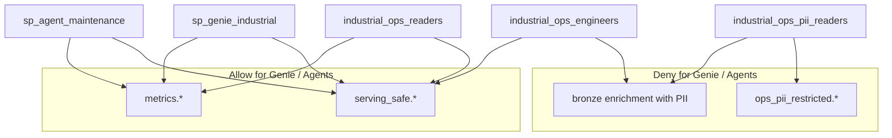

# Governance & security (operations)

Industrial PI tag values are generally non-PII. **PII enters through people-linked enrichment** (CMMS techs, alarm ack names, shift supervisors/operators, free-text handoff notes).

Canonical inventories:

- [../../governance/pii_inventory.md](../../governance/pii_inventory.md)
- [../../governance/access_matrix.md](../../governance/access_matrix.md)
- [../../governance/tag_taxonomy.md](../../governance/tag_taxonomy.md)
- SQL: `databricks/sql/06_pii_masks_and_filters.sql`

---

## 1. Security model diagram

---

## 2. Groups to create (account level)

| Group | Purpose |
|---|---|
| `industrial_ops_engineers` | Pipeline owners — RW on bronze/silver/gold |
| `industrial_ops_readers` | Analysts / Genie users — safe data |
| `industrial_ops_pii_readers` | HR/reliability leads needing identity |
| `plant_PLANT-01` | Plant-scoped row access (extend per site) |

---

## 3. Service principals

| SP | Purpose | Allowed schemas |
|---|---|---|
| `sp_pi_ingest` | Streaming + enrichment jobs | bronze RW, silver RW |
| `sp_genie_industrial` | Genie space | serving_safe R, metrics R |
| `sp_agent_maintenance` | Maintenance / RCA / shift agents | serving_safe R, metrics R |

**Hard deny:** Genie/agent SPs on `ops_pii_restricted` and on bronze enrichment tables that still contain names/emails/phones/badges.

---

## 4. Storage rules (layer by layer)

1. **Bronze** may contain PII in `*_raw` enrichment — restrict table ACLs.
2. **Silver** keeps `*_employee_id` where needed; names/emails/phones live only in `ops_pii_restricted`.
3. **Gold / metrics / serving_safe** must not expose direct identifiers.
4. Prefer `serving_safe` views over direct gold if columns may later gain PII.
5. Plant row filters required before multi-site production.

---

## 5. PII field classes (summary)

| Class | Examples | Retention guidance |
|---|---|---|
| Direct identifier | technician_email, badge_id, supervisor_phone, names | See inventory (WO +2y, alarm +1y, shift people 90d ops) |
| Sensitive free text | handoff_notes, WO notes | Short TTL; redact for serving |
| Quasi-identifier | crew_id, employee_id alone, plant+shift+role | Align to parent entity |
| Non-PII | PI tag values | Long engineering retention |

Full table: [../../governance/pii_inventory.md](../../governance/pii_inventory.md).

---

## 6. Technical controls implemented in SQL

| Control | Mechanism |
|---|---|
| Column masks | `mask_email`, `mask_phone`, `mask_name` UDFs; unmask only for `industrial_ops_pii_readers` |
| Row filter | `plant_filter(plant_id)` for plant tenancy |
| UC tags | `sensitivity`, `domain` on PII tables; taxonomy for columns |
| Serving redaction | Role proxy, `was_acked`, regex person scrub on handoff notes |

**Ops note:** Demo regex redaction is not a complete NER solution. Do not treat it as production-grade de-identification for arbitrary free text.

---

## 7. Agent / Genie logging rules

Allowed in logs/prompts:

- `asset_id`, `work_order_id`, `alarm_id`, `crew_id`, plant/area ids, timestamps, scores

Forbidden:

- email, phone, badge_id, clear-text person names
- Direct queries to `ops_pii_restricted`

Identity lookup is **human-only** via privileged group — not an agent tool in MVP ([../../agents/tool_contracts.md](../../agents/tool_contracts.md)).

---

## 8. Audit checklist (run before go-live)

- [ ] UC audit log enabled for catalog `industrial_ops`
- [ ] Column masks applied on email/phone/name
- [ ] Row filters by `plant_id` on PII tables
- [ ] Genie space tables = serving_safe + metrics only
- [ ] Agent tool allowlist excludes `ops_pii_restricted`
- [ ] No PII in agent prompt/debug logs
- [ ] Purge/TTL job planned for `shift_people` and handoff notes
- [ ] Grants reviewed for each SP and group
- [ ] Negative test: Genie SP `SELECT` on PII table fails

---

## 9. Incident response (PII exposure)

1. Revoke Genie/agent grants immediately if mis-bound.
2. Identify exposed objects and time window via UC audit.
3. Rotate any leaked credentials; purge unsafe Genie certified answers if they embed PII.
4. Re-bind consumers to `serving_safe` / `metrics` only.
5. Update inventory if a new PII field was the root cause.
