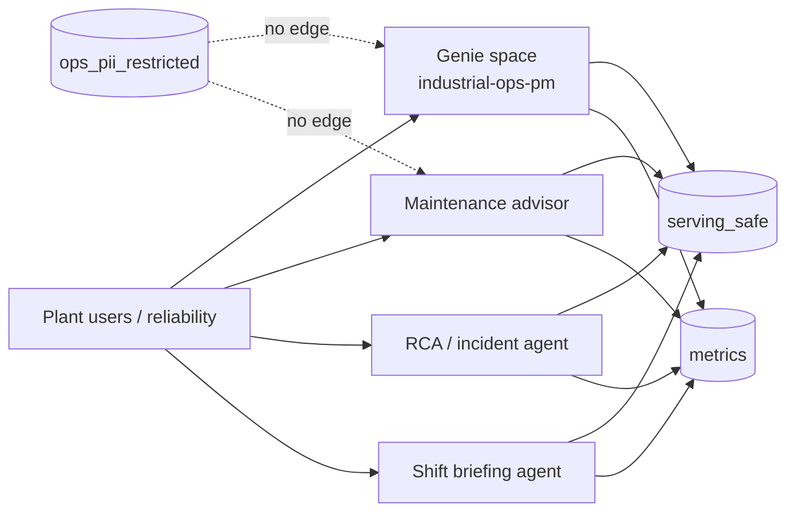

# Agents & Genie — operations guide

MVP delivers **contracts and setup notes**, not a hosted agent runtime. Ops configures Databricks Genie and (later) agent tool bindings against governed views only.

Source specs:

- [../../agents/genie_space.md](../../agents/genie_space.md)
- [../../agents/tool_contracts.md](../../agents/tool_contracts.md)
- [../../agents/system_prompts.md](../../agents/system_prompts.md)

---

## 1. Consumer architecture

All agents run conceptually as `sp_agent_maintenance`.  
Genie uses `sp_genie_industrial`.

---

## 2. Genie space setup

| Setting | Value |
|---|---|
| Space name | `industrial-ops-pm` |
| SP | `sp_genie_industrial` |
| Privileges | `SELECT` on `serving_safe` + `metrics` only |

### Bind these objects only

- `industrial_ops.serving_safe.assets`
- `industrial_ops.serving_safe.asset_health_daily`
- `industrial_ops.serving_safe.pi_timeseries_recent`
- `industrial_ops.serving_safe.work_orders`
- `industrial_ops.serving_safe.alarms`
- `industrial_ops.serving_safe.maintenance_outcomes`
- `industrial_ops.serving_safe.oee_daily`
- `industrial_ops.serving_safe.shifts`
- `industrial_ops.metrics.asset_health_score`
- `industrial_ops.metrics.anomaly_rate_7d`
- `industrial_ops.metrics.mtbf_proxy`
- `industrial_ops.metrics.oee_by_line`

### Never bind

- Anything in `ops_pii_restricted`
- Bronze enrichment tables with identity columns

### Sample questions (smoke)

1. What is the health score trend for PMP-12 over the last 7 days?
2. Which assets have `anomaly_flag = true` today?
3. Show open work orders for criticality A assets.
4. Compare OEE proxy for LINE-A vs LINE-B.
5. List high-severity uncleared alarms.

Add certified answers for `health_score` and `anomaly_rate_7d` definitions (see gold SQL formulas).

---

## 3. Agent portfolio

### 3.1 Maintenance advisor

**Goal:** Prioritize assets needing attention; suggest next actions from health + open WOs.

| Tool | Inputs | Source |
|---|---|---|
| `list_unhealthy_assets` | plant_id, min_health (default 70) | `metrics.asset_health_score` |
| `get_asset_health` | asset_id, days | `serving_safe.asset_health_daily` |
| `list_open_work_orders` | asset_id?, plant_id? | `serving_safe.work_orders` WHERE status='OPEN' |
| `get_anomaly_rate` | asset_id | `metrics.anomaly_rate_7d` |
| `get_mtbf_proxy` | asset_id | `metrics.mtbf_proxy` |

Prompt gist: actionable, no invented identities; if health &lt; 70 or anomaly, recommend inspection and cite open WOs.

### 3.2 RCA / incident agent

**Goal:** Correlate tags, alarms, downtime in a window; evidence before conclusions.

| Tool | Inputs | Source |
|---|---|---|
| `get_alarms_in_window` | asset_id, start, end | `serving_safe.alarms` |
| `get_tag_series` | asset_id, tag_suffix, start, end | `serving_safe.pi_timeseries_recent` |
| `get_downtime_events` | asset_id, start, end | OEE / production via safe surfaces |
| `get_recent_failures` | asset_id | `serving_safe.maintenance_outcomes` |

### 3.3 Shift briefing agent

**Goal:** Overnight summary for incoming `crew_id` without personal contact data.

| Tool | Inputs | Source |
|---|---|---|
| `get_shift_context` | plant_id, area_id, as_of | `serving_safe.shifts` |
| `list_overnight_anomalies` | plant_id, hours | health / alarms safe views |
| `list_open_high_priority_wos` | plant_id | `serving_safe.work_orders` |
| `list_active_alarms` | plant_id | uncleared alarms |

Default time window for tools: last **24 hours** unless specified.

---

## 4. Shared agent rules (enforce in runtime)

1. Log only `asset_id`, `work_order_id`, `alarm_id`, `crew_id` (plus non-PII metrics).
2. If user asks for a person by name → refuse; escalate to reliability lead (PII path).
3. Never add tools that query `ops_pii_restricted`.
4. Privileged identity lookup is human-only for `industrial_ops_pii_readers`.

---

## 5. Ops go-live checklist

- [ ] serving_safe + metrics populated and sanity-checked
- [ ] Grants applied; negative PII access test passed
- [ ] Genie space created with allowlisted tables only
- [ ] Certified answers for health/anomaly metrics
- [ ] Agent runtime (when available) uses tool contracts verbatim
- [ ] System prompts loaded from `agents/system_prompts.md`
- [ ] Sample questions return non-empty, non-PII answers

---

## 6. Known MVP gaps

| Gap | Impact |
|---|---|
| No agent host in repo | Contracts are documentation until wired to Databricks Apps / external orchestrator |
| Shift note redaction is demo regex | Replace before production free-text |
| `03_silver_gold_transforms` stub | Genie depends on SQL scripts being run |
| Single plant demo data | Row filters ready conceptually for multi-plant later |
