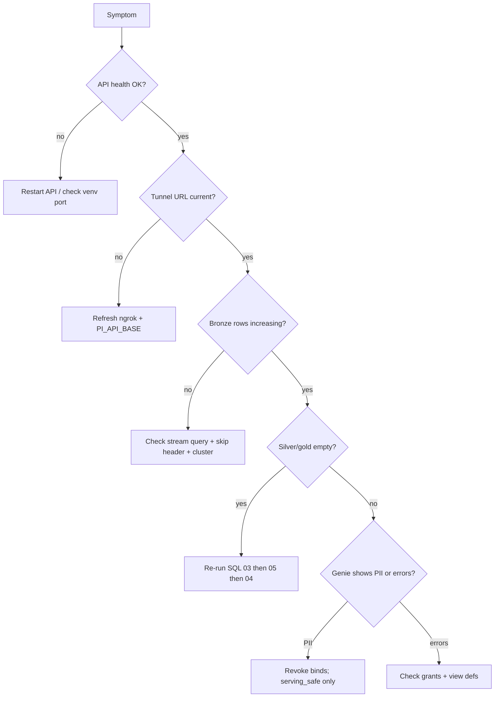

# Troubleshooting (on-call)

Quick diagnosis for the most common PIAgents failures.

---

## 1. Decision tree



---

## 2. Local API

| Symptom | Likely cause | Fix |
|---|---|---|
| Connection refused on 8081 | Process down / wrong port | `./scripts/run_api.sh` or uvicorn; confirm `PORT` |
| `/health` fails in venv | Missing deps | `pip install -r api/requirements.txt` |
| Empty snapshot | Simulator bug / import error | Check uvicorn logs; run `pytest tests/test_smoke.py` |
| SSE stalls | Client timeout | Prefer `/snapshot/points` for Databricks |

---

## 3. Tunnel / Azure reachability

| Symptom | Likely cause | Fix |
|---|---|---|
| Databricks `JSONDecodeError` / HTML body | ngrok free interstitial | Send header `ngrok-skip-browser-warning: true` (already in notebook) |
| `URLError` / timeout | Tunnel dead or wrong URL | Restart ngrok; update `PI_API_BASE` and bundle var |
| Works on laptop, fails on cluster | Cluster using stale env | Restart cluster after env change |
| HTTPS cert errors | Broken reverse proxy | Use official ngrok HTTPS URL |

---

## 4. Bronze streaming

| Symptom | Likely cause | Fix |
|---|---|---|
| No new rows | Stream not started / query failed | Check notebook streaming panel; driver logs for `fetch failed` |
| Checkpoint errors | Volume missing / permissions | Ensure `industrial_ops.bronze.landing` exists; SP has volume access |
| Duplicate bursts | Multiple stream queries | Stop extras; one query per checkpoint path |
| Cluster cost climbing | Stream left running | Cancel query; stop cluster |

Manual fetch test from a notebook is documented in [02_mock_pi_api.md](02_mock_pi_api.md).

---

## 5. Enrichment batch

| Symptom | Likely cause | Fix |
|---|---|---|
| Path not found | CSVs not uploaded | Upload to `/Volumes/industrial_ops/bronze/landing/` |
| Zero rows | Empty/wrong CSV | Validate headers vs DDL; re-upload |
| Schema mismatch | Extra/missing columns | Align CSV header to `02_bronze_tables.sql` |

---

## 6. UC / SQL

| Symptom | Likely cause | Fix |
|---|---|---|
| `CREATE CATALOG` fails | Metastore has no default storage root | Create catalog with `storage_root` via API/UI first ([03](03_databricks_runbook.md)) |
| Schema not found | Foundation SQL not run | Run `01_uc_foundation.sql` |
| View create fails | Gold/silver missing | Run SQL in documented order |
| Mask function errors | Groups not created | Create `industrial_ops_pii_readers` etc. before masks SQL |

---

## 7. Governance / Genie

| Symptom | Likely cause | Fix |
|---|---|---|
| Genie returns names/emails | Wrong tables bound | Remove bronze/PII; bind serving_safe only |
| Permission denied on safe views | Grants missing | Re-run grants section of `06_pii_masks_and_filters.sql` |
| Masks not applying | ALTER MASK not run / wrong column | Re-apply SQL; DESCRIBE EXTENDED |
| Agent invents people | Prompt/tool leak | Enforce tool allowlist + system prompts |

---

## 8. Jobs / bundle

| Symptom | Likely cause | Fix |
|---|---|---|
| Deploy to wrong workspace | CLI profile | Confirm host matches Azure adb URL |
| Job uses serverless | Bundle edited incorrectly | Restore `existing_cluster_id`; forbid environment_key serverless |
| Task `silver_gold` no-ops | Notebook is stub | Run SQL `03`/`05` manually |

---

## 9. Useful diagnostic SQL

```sql
-- Freshness
SELECT max(ingest_ts) AS last_pi_ingest,
       count(*) AS pi_rows
FROM industrial_ops.bronze.pi_timeseries_raw;

-- Health presence
SELECT day_dt, asset_id, health_score, anomaly_flag
FROM industrial_ops.gold.asset_health_daily
ORDER BY day_dt DESC, health_score ASC
LIMIT 50;

-- Confirm serving_safe has no email-like columns (manual review)
DESCRIBE TABLE industrial_ops.serving_safe.work_orders;
DESCRIBE TABLE industrial_ops.serving_safe.shifts;
```

---

## 10. Escalation

| Issue class | Escalate to |
|---|---|
| Cluster / workspace / UC admin | Platform / Databricks admin |
| Cost / runaway compute | FinOps + platform |
| PII exposure | Security + data owner immediately |
| Health formula / metric definition | Data engineering / reliability SME |
| API / tunnel | App operator on the Mac host |
